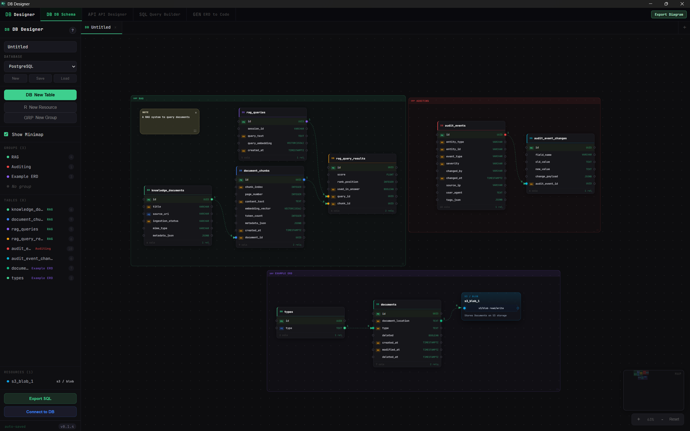
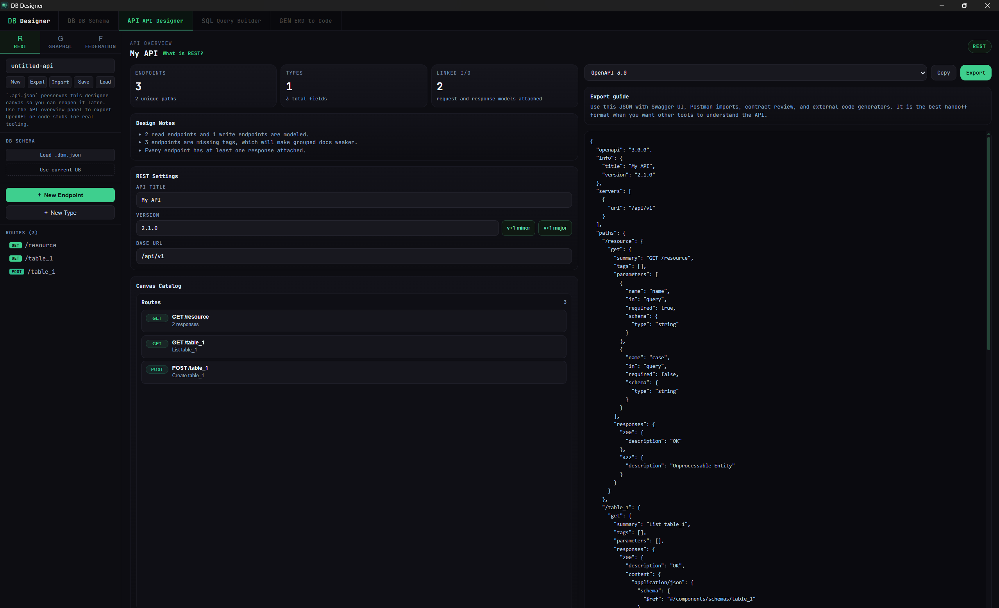
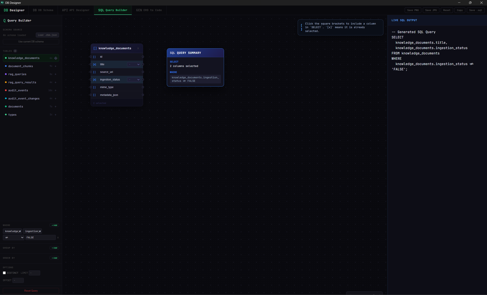
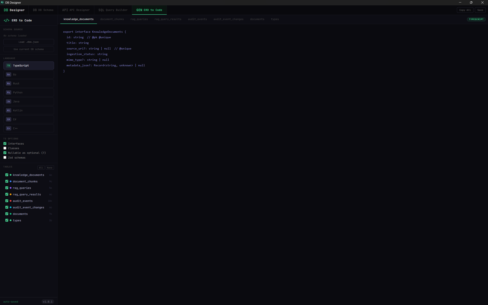

# DB Designer

[](https://tauri.app/)
[](https://vuejs.org/)
[](https://www.rust-lang.org/)
[](https://www.typescriptlang.org/)
[](LICENSE)

**DB Designer** is a professional, desktop-first visual workspace for architects and developers. Design database schemas, model APIs, build complex SQL queries visually, and generate production-ready starter code—all from a single, unified ERD-driven interface.

Built with **Vue 3**, **TypeScript**, and **Rust (Tauri)**, it delivers a high-performance canvas experience with native desktop capabilities.

---

## Key Workspaces

### DB Schema (ERD)


The core engine of your design. Move beyond basic boxes-and-lines.
- **Visual Canvas:** Multi-tab editing with a high-performance draggable layout.
- **Smart Grouping:** Organize tables into nested groups with locking mechanisms.
- **Deep Modeling:** Precise control over types, nullability, PK/FK, uniqueness, and defaults.
- **Native Import:** Live schema extraction from PostgreSQL, MySQL, SQLite, and SQL Server.
- **Visual Exports:** Export your designs as high-resolution **SVG**, **JPG**, or **PNG** for documentation.

### Mermaid & Documentation
Seamlessly integrate your designs into your technical documentation.
- **Mermaid Export:** Generate Mermaid.js syntax for your ERDs to use in GitHub, GitLab, or Notion.
- **Vector Support:** High-quality **SVG** exports preserve scalability for large-scale architecture diagrams.
- **Raster Formats:** Quick **JPG** and **PNG** exports for presentations and quick sharing.

### API Designer


Bridge the gap between your data layer and your interface.
- **Multi-Protocol:** Design for **REST**, **GraphQL**, and **Apollo Federation**.
- **Schema-Driven:** Bootstrap API nodes directly from your database tables.
- **Rich Metadata:** Define methods, paths, params, and response bodies visually.
- **Protocol Specifics:** Manage GraphQL Unions, Interfaces, and Federation entity keys.

### Visual Query Builder


Write SQL without the syntax headaches.
- **Drag-and-Drop Joins:** Visually connect columns to create INNER, LEFT, RIGHT, or FULL joins.
- **Powerful Aggregations:** Integrated support for `COUNT`, `SUM`, `AVG`, `MIN`, and `MAX`.
- **Advanced Filtering:** Visual WHERE clause builder, GROUP BY, and ORDER BY configuration.
- **Instant Preview:** Live SQL generation with manual override support.

### ERD to Code (Codegen)


Accelerate your development cycle with multi-language model generation.
- **Supported Targets:** TypeScript (Interfaces/Classes/Zod), Go (Structs/JSON tags), Rust (Serde), Python (Pydantic/SQLAlchemy), Java, Kotlin, C#, and C++.
- **Customizable Output:** Selective table inclusion and dialect-specific mapping.

---

## Tech Stack

| Component | Technology |
| :--- | :--- |
| **Frontend** | [Vue 3](https://vuejs.org/) (Composition API) |
| **State** | [Pinia](https://pinia.vuejs.org/) |
| **Canvas** | [Vue Flow](https://vueflow.dev/) |
| **Shell** | [Tauri 2](https://tauri.app/) |
| **Backend** | [Rust](https://www.rust-lang.org/) |
| **Database** | [SQLx](https://github.com/launchbadge/sqlx) |
| **Styling** | [Tailwind CSS](https://tailwindcss.com/) |

---

## Getting Started

### Prerequisites
- **Node.js:** 18.x or newer
- **Rust:** Latest stable toolchain
- **OS:** [Tauri Prerequisites](https://tauri.app/v1/guides/getting-started/prerequisites) (WebView2 on Windows, etc.)

### Installation
```bash
# Clone the repository
git clone https://github.com/Graham/DB-Designer.git
cd DB-Designer

# Install dependencies
npm install
```

### Development
```bash
# Run in the browser (Frontend only)
npm run dev

# Run as a desktop app (Tauri + Rust)
npm run tauri dev
```

### Build
```bash
# Build the desktop executable
npm run tauri build
```

---

## Project Structure

```text
src/
├── components/       # Workspace-specific UI (ERD, API, Query, Codegen)
├── stores/           # Pinia stores for unified state management
├── types/            # Shared TypeScript domain models
└── composables/      # Shared logic (exports, canvas utilities)

src-tauri/
├── src/
│   ├── db.rs         # Native Rust database connectors (SQLx)
│   └── lib.rs        # Tauri command registration
└── tauri.conf.json   # Desktop app configuration
```

---

## Roadmap & Status
The project is currently feature-complete on the frontend. The **Tauri + Rust** backend is fully wired for native database imports across PostgreSQL, SQLite, MySQL, and SQL Server.
- [x] Visual ERD & Grouping
- [x] API Modeling (REST/GraphQL)
- [x] Visual Query Builder
- [x] Multi-language Codegen
- [x] Native DB Import (Rust Integration)
- [ ] End-to-end validation with production datasets

---

## License
This project is licensed under the **GNU General Public License v3.0** with a special exception:

- **Source Code:** Must remain under GPLv3. Any modifications or derivatives of the tool itself must be open-sourced under the same license.
- **Generated Content:** All content produced by this tool (SQL, API models, generated code, diagrams, etc.) is exempt from GPL requirements and can be used under any license of your choice.

See the [LICENSE](LICENSE) file for the full text and exception details.

---
<p align="center">Made with passion for Database Architects</p>


